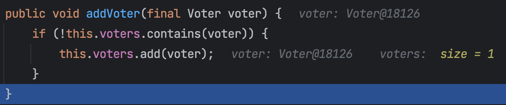
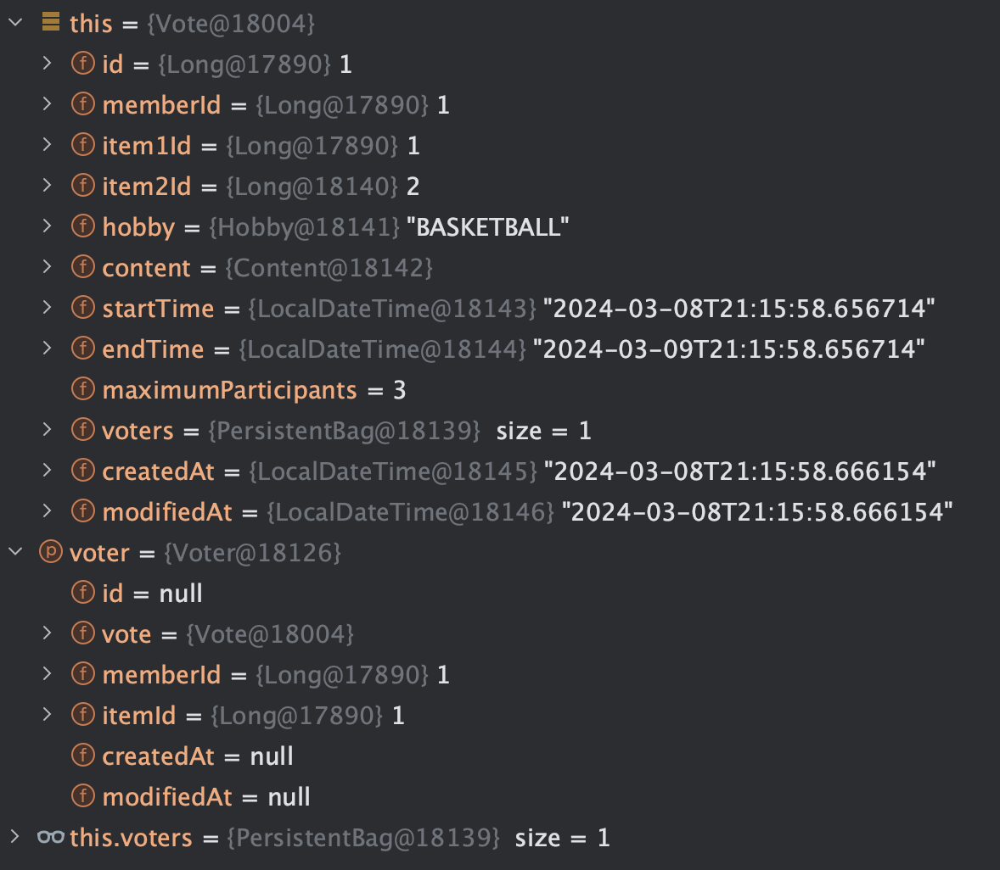
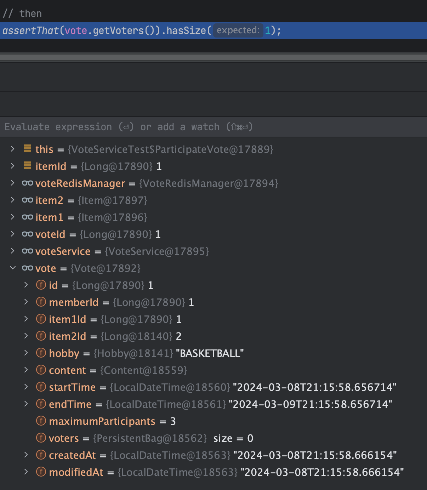

# 문제 상황 (아직 작성 중)
문제 상황을 소개하기 전, 먼저 엔티티에 대한 소개부터 하겠습니다.

## 엔티티 소개
#### 1. Vote.Java
```java
@Entity
public class Vote {
    // ...
    @OneToMany(mappedBy = "vote", cascade = CascadeType.ALL)
	private final List<Voter> voters = new ArrayList<>();

	public void addVoter(final Voter voter) {
		if (!this.voters.contains(voter)) {
			this.voters.add(voter);
		}
	}
```
### 2. Voter.Java
```java
@Entity
public class Voter {
    // ...
    @ManyToOne(fetch = FetchType.LAZY)
	@JoinColumn(name = "vote_id", nullable = false)
	private Vote vote;

	public void participate(final Long itemId) {
		this.itemId = itemId;
		this.vote.addVoter(this);
	}
```
이 두 엔티티는 투표(Vote)와 투표자(Voter)를 나타냅니다. 하나의 투표에는 여러 명의 투표자가 참여할 수 있으므로, 투표(Vote)와 투표자(Voter)는 1:N 관계를 가지고 있습니다. 이를 양방향 매핑으로 연결하였습니다.

이제 문제 상황에 대해 살펴봅시다. 이 문제는 투표 서비스의 '투표 참여' 기능을 통합 테스트를 수행하던 중 발생하였으며, 발생한 예외는 org.hibernate.LazyInitializationException입니다.

투표 참여 기능은 아래의 메서드들에서 수행됩니다.

### 1. VoteService.participateVote()
```java
public void participateVote(
		final Long voteId,
		final Long itemId
	) {
		final Long memberId = memberUtils.getCurrentMemberId();
		final Vote vote = voteReader.read(voteId);

		if (!vote.isVoting()) {
			throw new BusinessException(ErrorCode.VOTE_CANNOT_PARTICIPATE);
		}

		if (!vote.containsItem(itemId)) {
			throw new BusinessException(ErrorCode.VOTE_NOT_CONTAIN_ITEM);
		}

		voteManager.participate(vote, memberId, itemId);
	}
```

### 2. VoteManager.participate()
```java
@Transactional
public void participate(
    final Vote vote,
    final Long memberId,
    final Long itemId
) {
    final Voter voter = new Voter(vote, memberId, itemId);

    voter.participate(itemId);
}
```

### 3. VoteServiceTest.participateVoteTest() - 문제가 발생한 테스트
```java
@Test
@DisplayName("회원은 투표 아이템 중 하나를 선택하여 투표할 수 있다.")
void participateVoteTest() {
    // given
    final Long itemId = vote.getItem1Id();

    given(memberUtils.getCurrentMemberId())
        .willReturn(1L);

    // when
    voteService.participateVote(voteId, itemId);

    // then
    assertThat(vote.getVoters()).hasSize(1);
}
```
예외가 발생한 부분은 다음과 같습니다.

```
org.hibernate.LazyInitializationException: failed to lazily initialize a collection of role: com.programmers.lime.domains.vote.domain.Vote.voters: could not initialize proxy - no Session

	at org.hibernate.collection.spi.AbstractPersistentCollection.throwLazyInitializationException(AbstractPersistentCollection.java:635)
	at org.hibernate.collection.spi.AbstractPersistentCollection.withTemporarySessionIfNeeded(AbstractPersistentCollection.java:218)
	at org.hibernate.collection.spi.AbstractPersistentCollection.readElementExistence(AbstractPersistentCollection.java:336)
	at org.hibernate.collection.spi.PersistentBag.contains(PersistentBag.java:365)
	at com.programmers.lime.domains.vote.domain.Vote.addVoter(Vote.java:106)
	at com.programmers.lime.domains.vote.domain.Voter.participate(Voter.java:53)
	at com.programmers.lime.domains.vote.implementation.VoteManager.participate(VoteManager.java:29)
```

<br>

# 원인 추론
예외 메시지를 보면, Hibernate의 세션(영속성 컨텍스트)이 없어서 프록시 초기화에 실패했다는 내용이 있습니다. VoteService에서 Vote 엔티티를 읽어온 후, 그 안에 있는 voters 리스트(프록시)를 로드하지 않은 상태에서 contains 메서드를 호출하려고 하자, 세션이 이미 닫혀 있어서 지연 로딩을 수행하지 못해 이런 예외가 발생한 것으로 보입니다.

## 🤔 왜 운영 환경에서는 정상적으로 작동하나요?
운영 환경에서는 OSIV(Open Session In View)가 활성화되어 있습니다. 이로 인해, 웹 요청이 시작된 시점부터 종료될 때까지 세션이 유지되므로 지연 로딩이 원활하게 작동합니다. OSIV는 일반적으로 웹 요청에 대해서만 활성화되며, 테스트 환경에서는 활성화되지 않습니다. 따라서, 테스트 환경은 OSIV가 꺼져 있는 환경으로 생각하면 됩니다.

운영 코드에서도 OSIV를 비활성화하고 실행해보니, 테스트 환경과 동일하게 LazyInitializationException이 발생하였습니다.

## 🤔 VoteService는 트랜잭션이 없어도 VoteManager은 트랜잭션이 있는데 지연 로딩 안되나요?
VoteService는 트랜잭션을 사용하지 않지만, VoteManager는 트랜잭션을 사용하고 있습니다. 이는 다른 세션을 열어도 지연 로딩이 작동하지 않는다는 다는 것을 의미합니다. 추측이지만 세션이 닫히는 즉시 프록시가 일반 객체가 되어서 할 수 없는 건 아닐까 생각해봅니다. (확인 필요)

## 🤔 왜 서비스에는 @Transactional을 붙이지 않았나요?
서비스에 @Transactional 어노테이션이 붙지 않은 이유는, 우리 팀이 OSIV를 활성화하여 지연 로딩을 사용하기로 결정하였고, 트랜잭션의 범위를 최소화하기로 결정하였기 때문입니다. 그래서 변경이 발생하는 VoteManager에만 트랜잭션이 적용되었습니다.

<br>

# 해결책
## 1. 테스트 코드에 @Transactional 적용
첫 번째 방법은 테스트 코드에 @Transactional을 붙이는 것입니다. 테스트 코드에 @Transactional 어노테이션을 적용하여, 테스트 진행 동안 세션을 유지하는 것입니다. 단, 테스트 코드에서 @Transactional 어노테이션을 사용하려면 주의가 필요합니다.

## 2. Eager 로딩으로 변경
두 번째 방법은 Eager 로딩으로 변경하는 것입니다. 하지만 이 방법을 시도하였을 때 테스트가 실패하였습니다. 데이터는 1개가 들어가는데 테스트 상에서는 0개가 있다고 뜨면서 실패했습니다. 원인에 대해서는 아직 조사 중입니다.




디벙깅 진행 중에는 정상적으로 voters 사이즈가 1이었다가 테스트 코드로 돌아오니 vote의 voters의 사이즈가 0으로 바뀌었습니다.

그래서 주소값을 확인해보니 vote의 주소값이 서비스에서 확인했던 vote 주소값과 다른 값을 가지고 있었습니다.


영속성 컨텍스트는 동일성을 보장하기 위해 지연 로딩 대상인 프록시는 항상 같은 프록시 객체를 반환한다고 했는데 다른 영속성 컨텍스트에서 조회를 하니까 다른 객체를 반환한 것 아닐까 추측합니다. (확인 필요)

## 3. 서비스 코드에 @Transactional 적용
마지막으로, 세 번째 방법은 서비스 코드에 @Transactional을 붙이는 것입니다. 이 방법도 간단하다고 생각하고 실행해봤지만, 테스트가 실패하였습니다. 이 역시 원인은 2번째 해결책의 실패 원인과 동일한 것으로 추정됩니다.

<br>

# 결론
현재로서는 첫 번째 방법인 테스트 코드에 @Transactional을 적용하는 방법을 선택했습니다. 물론, 계속해서 더 좋은 방법을 찾아보고, 적절한 해결책을 찾게 되면 즉시 적용할 것입니다.

테스트는 항상 어려운 부분입니다. 생각했던 대로 작동하지 않을 때 당황스러운 순간도 있지만, 테스트 코드를 통과하는 과정은 매우 재미있습니다. 또한, 테스트를 작성함으로써 더 안정적이고 유지보수가 쉬운 코드를 만들 수 있다는 것이 뿌듯합니다. 앞으로도 계속해서 테스트 코드 작성법을 학습하고 많이 작성하여 연습할 계획입니다.